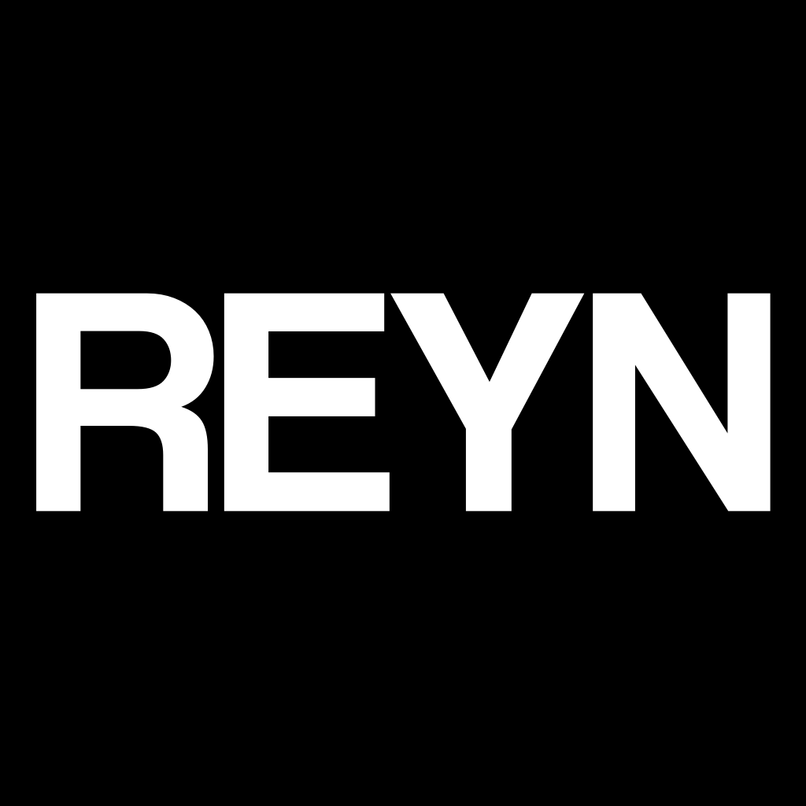

<h1 align="center">REYN - FLUID SIMULATION</h1>
<h3 align="center">A CUDA-based Implementation of Smoothed Particle Hydrodynamics for Fluid Simulation</h3>

    

## AUTO-GENERATED VIDEO OF CURRENT STATE

    

## FEATURES
- Zero-Copy GUI thanks to CUDA <-> OpenGL buffer sharing, throttled to not impact simulation performance
- Interchangable kernel functions (Wendland C2, C6, Cubic B-Spline, Double Cosine, ...) with CRTP static polymorphism for maximum runtime performance and ergonomics of adding new functions
- GPU-friendly spatial acceleration datastructure for fixed radius neighbourhood queries with work-efficient construction and constant query time, optionally reordering particles for memory coherency
- Automatic testing of kernel functions and spatial acceleration datastructures using `doctest` and benchmarking using `nanobench`

## TODO
- [x] Test zero-copy OpenGL VBO to CUDA buffer interop
- [x] Add efficient visualization and GUI based on OpenGL interop, including ImGUI elements and single-batch billboard sphere rendering
- [x] Implement safer abstraction over device arrays (no manual `cudaMalloc` and `cudaFree`) that is interoperable with both `thrust` and OpenGL
- [x] Implement acceleration datastructure, e.g. [Hoetzlein, 2014] using efficient prefix scan
- [x] Add benchmarking for performance optimization
- [x] Reorder state according to space-filling curve to improve memory coherency
- [x] Colour particles according to some attribute like velocity
- [x] Use Structure of Arrays (SoA) layout for all particle attributes to improve coalescing
- [x] Parameterize uniform grid with cell size different from search radius and benchmark for optimal grid size
- [x] Add random boundary sampling and de-/serialization
- [x] Add blue noise boundary sampling
- [x] Add boundary handling [Akinci et al. 2012]
- [x] Add adaptive (λ · Δt_CFL) time step size calculation using efficient reductions
- [x] Implement PICSPH
- [x] Add screenshot functionality -> automatic generation of video for docs
- [ ] Add fluid volume sampling and de-/serialization
- [ ] Add settings management with de-/serialization and expose solver and scene options to GUI and CLI
- [ ] Implement IISPH
- [ ] Optimize kernel launch configurations
- [ ] Add better logging with configurable verbosity
- [ ] Add plots to UI
- [ ] Use type aliases for safety (e.g. separating vectors and positions) and flexibility (change float precision, smaller index types for smaller scenes etc.)
